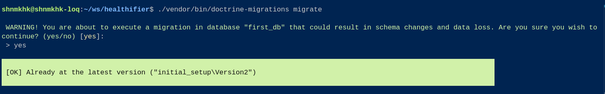
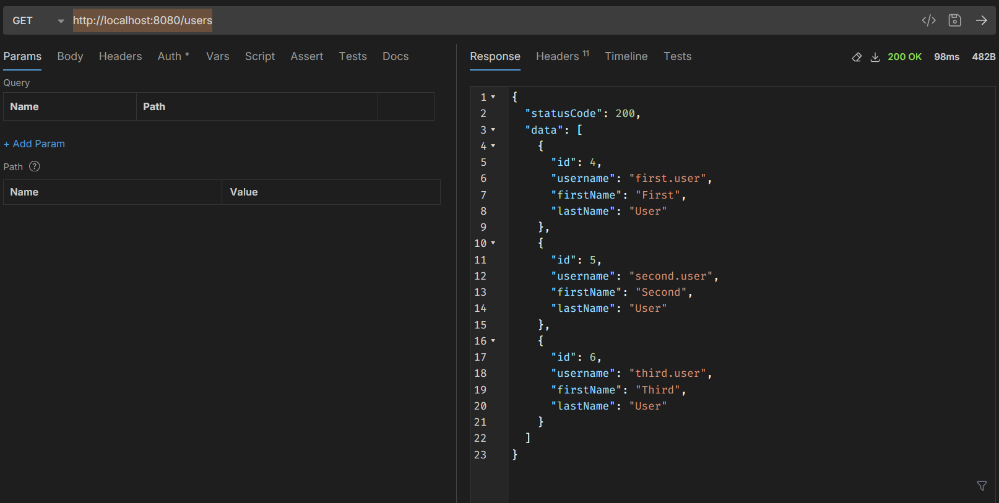

## Install the dependencies
```
composer install
```

## Start MySQL Server and run the DB Migrations
```
docker run --name mysql-instance-001 -p 3306:3306 -e MYSQL_ROOT_PASSWORD=my-secret-pw -d mysql
```

### Run the DB Schema Restore
```
./vendor/bin/doctrine-migrations migrate
```


### Run this command in the application directory to run the test suite
```bash
composer test
```

## Run the appp
```
php -S 0.0.0.0:8080 -t public
```
or
```
composer start
```

Or you can use `docker-compose` to run the app with `docker`, so you can run these commands:
```bash
docker-compose up -d
```


---
After that, open `http://localhost:8080` in your browser or run the following `cURL`
```
curl http://localhost:8080/users
```
```
{
  "statusCode": 200,
  "data": [
    {
      "id": 4,
      "username": "first.user",
      "firstName": "First",
      "lastName": "User"
    },
    {
      "id": 5,
      "username": "second.user",
      "firstName": "Second",
      "lastName": "User"
    },
    {
      "id": 6,
      "username": "third.user",
      "firstName": "Third",
      "lastName": "User"
    }
  ]
}
```


### Reference:
[Doctrine ORM Doc](https://www.doctrine-project.org/projects/doctrine-migrations/en/3.9/reference/managing-migrations.html#managing-migrations)
